Mermaid is a **powerful tool** for **creating diagrams and visualizations using text**. It is especially **useful in Markdown environments** like Obsidian, GitHub, and Notion (with extensions), where you can quickly visualize concepts using flowcharts, sequence diagrams, Gantt charts, and more.

Here's a **complete guide** on using Mermaid to create **flowcharts**:
[[toc]]

---
# FLowcharts 
## Basic Syntax

In Mermaid, flowcharts are declared using the `graph` or `flowchart` keyword followed by a flow direction:

- `TD` (Top to Bottom)
- `LR` (Left to Right)
- `BT` (Bottom to Top)
- `RL` (Right to Left)

The basic syntax for a Mermaid flowchart looks like this:

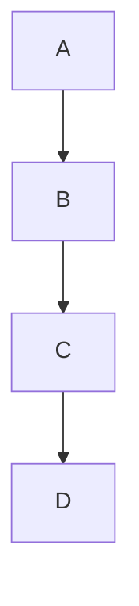

In this example:
- `graph TD` declares a top-to-bottom flowchart.
- The `-->` defines a directed edge (arrow) between nodes.


>[!danger] WARNING
If you are using the word "end" in a Flowchart node, capitalize the entire word or any of the letters (e.g., "End" or "END"), or apply this [workaround](https://github.com/mermaid-js/mermaid/issues/1444#issuecomment-639528897). Typing "end" in all lowercase letters will break the Flowchart.

>[!danger] WARNING
If you are using the letter "o" or "x" as the first letter in a connecting Flowchart node, add a space before the letter or capitalize the letter (e.g., "dev--- ops", "dev---Ops").
Typing "A---oB" will create a [circle edge](https://mermaid.js.org/syntax/flowchart.html#circle-edge-example).
Typing "A---xB" will create a [cross edge](https://mermaid.js.org/syntax/flowchart.html#cross-edge-example).

---
## Node Definition

Nodes can be defined in different styles:
1. **Text-only nodes**: Simply write the node’s label (e.g., `A` or `B`) and connect them with arrows.
  Prefer Writing within ```"`As This Supports Markdown`"```
2. **Styled nodes**: Use parentheses, brackets, or square brackets for different shapes.
- **Rectangle (Process):** use `A[Text]`
- **Rounded Rectangle (Action):** use `A(Text)`
- **Stadium (Input/Output):** use `A([Text])`
- **Circle (Start/End):** use `A((Text))`
- **Subroutine (Function):** use `A[[Text]]`
- **Rhombus (Decision):** use `A{Text}`
- **Cylinder (Data):** use `A[(Text)]`
- **Flag (Loops):** use `A>Text]`
- **Hexagon (Preparation):** use `A{{Text}}`
- **Double Circles(Stop):** Use `((()))`
- **Parallelogram (Input/Output):** use `A[/Text/]`
- **Trapezoid (Manual Operations):** use `A[/Text/]`
>[!info] You may use `\` instead of `/` to change the indent of paralleograms and trapezoids
## Arrows and Links

Arrows (`-->`) between nodes define the flow of the chart.
It is possible declare **many links in the same line** as  `A -- text --> B -- text2 --> C`
Links can be **made longer by adding extra dashes **
### Types : 

- **Straight Arrow**: `-->` 
- **Dotted Arrow**: `-.->` .
- **Thick Arrow**: `\==>` .
- **Invisible Link**: `~~~` 

- **Cross Arrow: `--x` 
- **Circle Arrow: `--o` 
- **Multi-Directional Arrow**: Suited with any type example `o--o` 

---


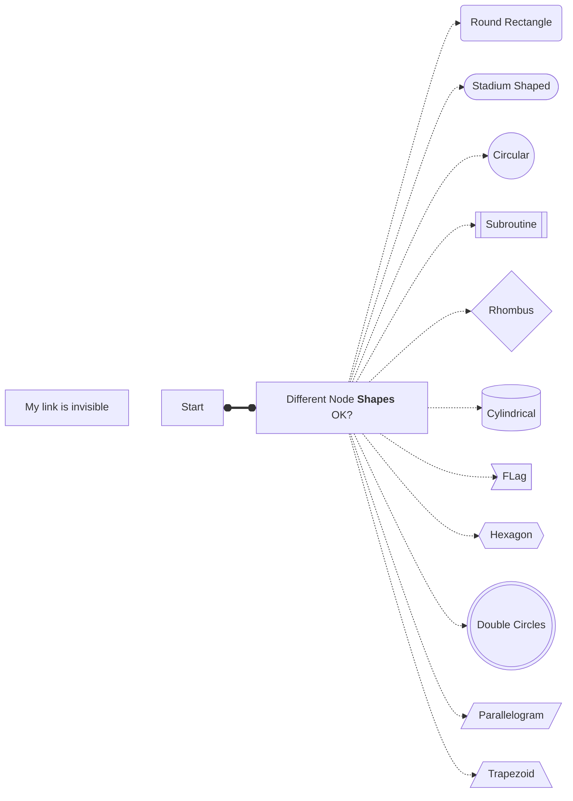

---
## Text in Nodes

### Link Labels
You can use the `|label|` syntax to add more complex or directional labels.

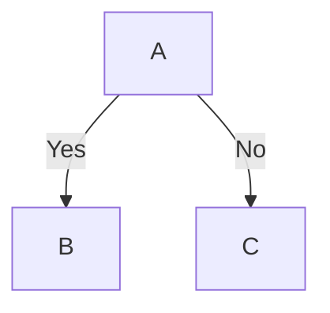
### Multiline Text in Nodes
To add multiline text inside a node, use `<br>` tags.

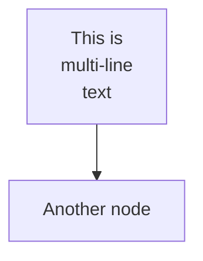


---

##  Subgraphs
Incorporated with `subgraph` as keyword it allow you to group nodes into sections. 
Each **Subgraph is a graph in itself**.** It has a direction but it **is ignored when it's connected parent has different direction**

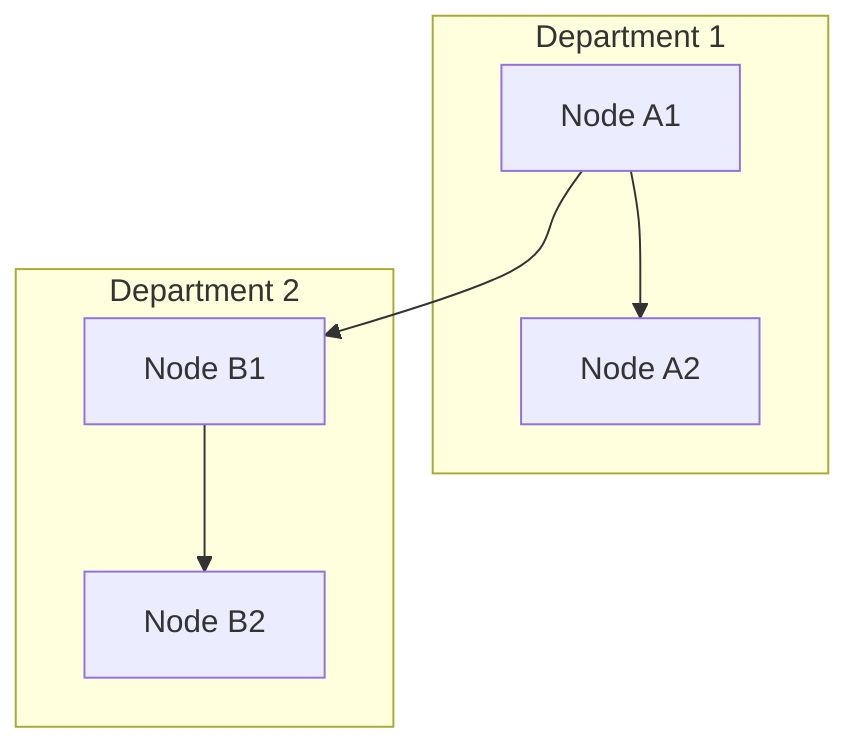

---

## Adding Text and Annotations

You can add plain text annotations outside of nodes using `:::` or within a node with `:::nodeClass`.

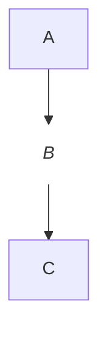

---
##  Node Styles and Customization

### Customizing Nodes
You can style individual nodes using the `style` directive.

- `fill`: Background color.
- `stroke`: Border color.
- `stroke-width`: Border thickness.

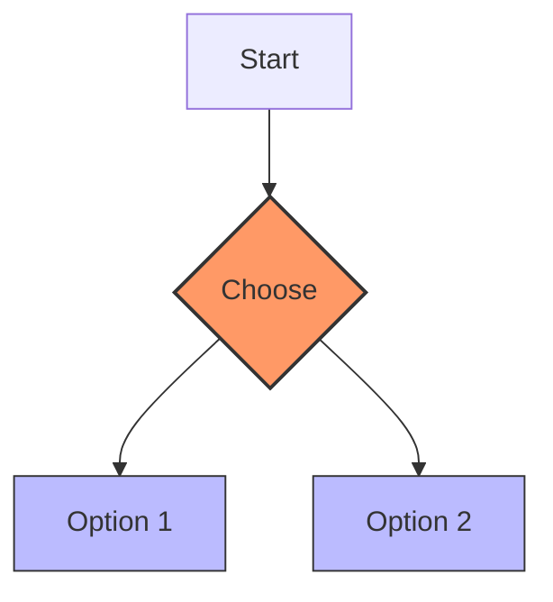

### Classes for Group Styling
You can group nodes under a class and then style them together.

- `classDef`: Defines the class styles.
- `class`: Assigns nodes to a class.


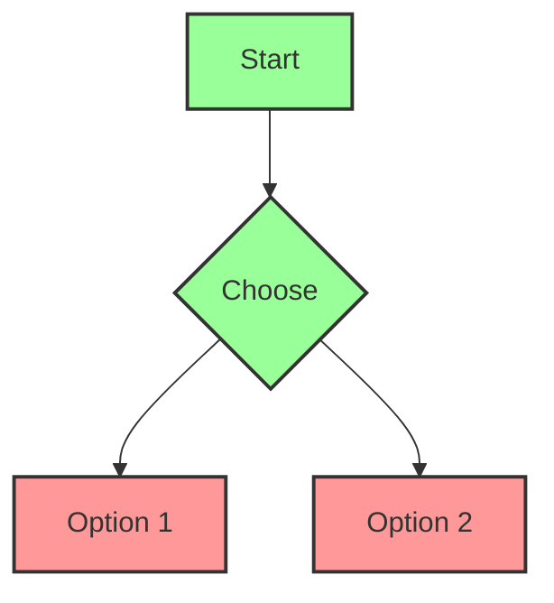

---
## Real-Life Examples

### Nested Decisions

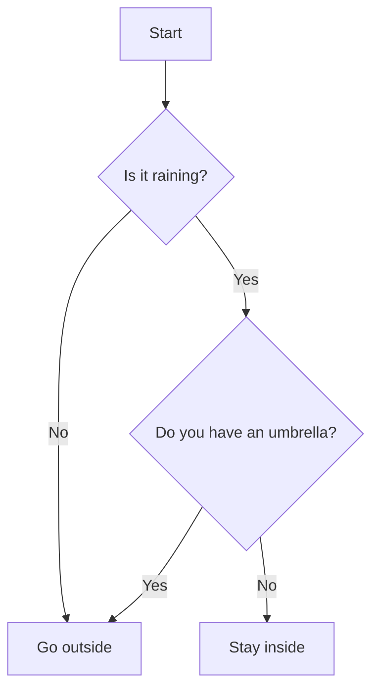

###  Multi-directional Flow

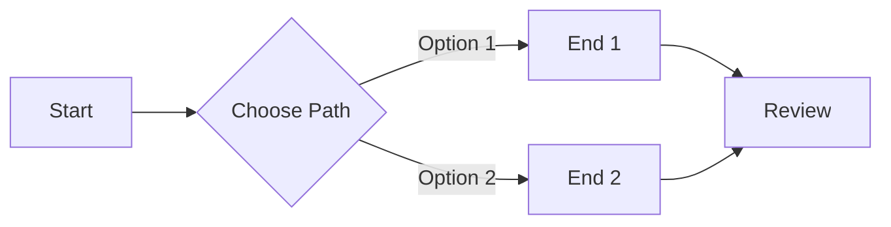

---
##  Tooling and Usage

### Supported Platforms
Mermaid is supported in various tools like:
- **Obsidian**: Directly supported in code blocks.
- **GitHub**: Add diagrams to your README files.
- **Markdown Editors**: Many editors with extensions support Mermaid.
- **Standalone tools**: You can render Mermaid diagrams with online editors (like [Mermaid Live Editor](https://mermaid-js.github.io/mermaid-live-editor/)).

---
# Sequence Diagram 

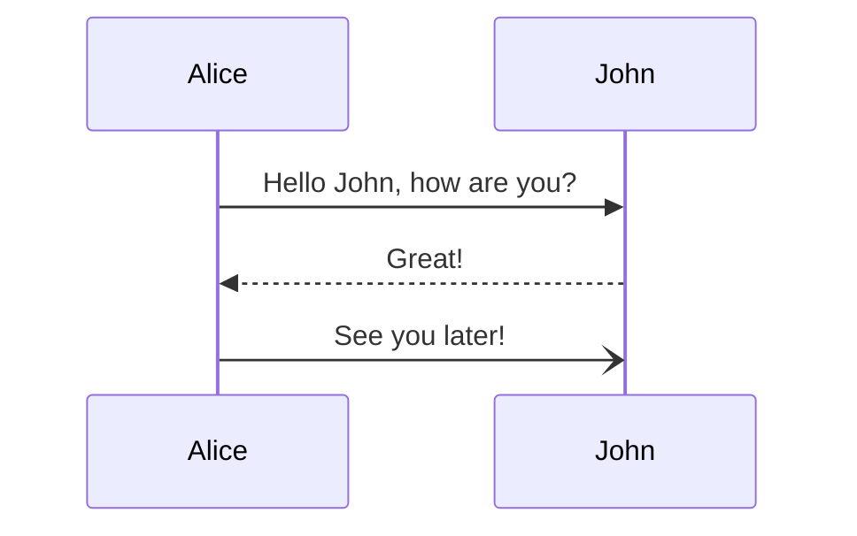

# Pie chart

Drawing a pie chart is really simple in mermaid.

- Start with `pie` keyword to begin the diagram
    - `showData` to render the actual data values after the legend text. This is **_OPTIONAL_**
- Followed by `title` keyword and its value in string to give a title to the pie-chart. This is **_OPTIONAL_**
- Pie slices will be ordered clockwise in the same order as the labels.
    - `label` for a section in the pie diagram within `" "` quotes.
    - Followed by `:` colon as separator
    - Followed by `positive numeric value` (supported up to two decimal places)

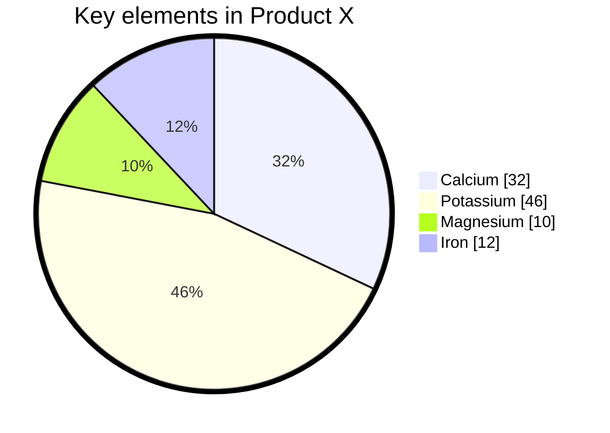

# Quadrant Chart

It is used to plot data points on a **two-dimensional grid,** with one variable represented on the x-axis and another variable represented on the y-axis.
The syntax is `<text>: [x, y]` here x and y value is in the range 0 - 1

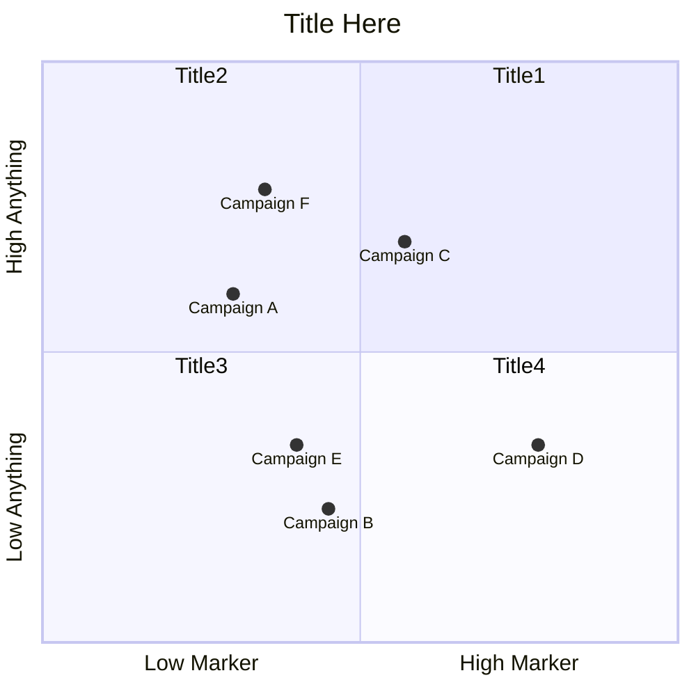

# Mind-Maps

The syntax for creating Mindmaps is simple and relies on indentation for setting the levels in the hierarchy.

Different Shapes discussed in flowchart are possible but not showing

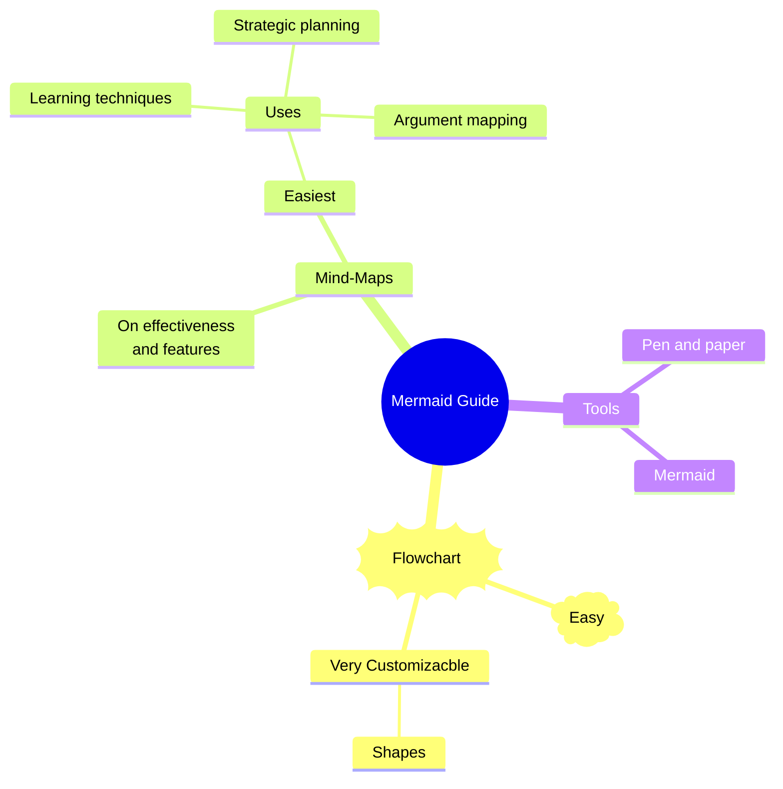

# TImeline

Start with `timeline` followed by title and its name. then mention time periods and add things as -

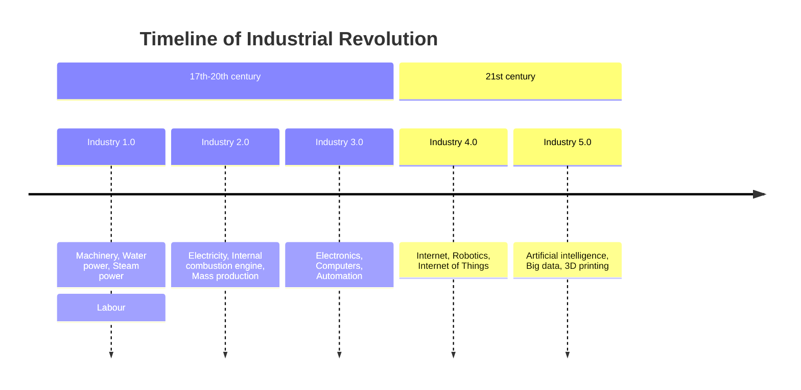

# XY Chart

The chart can be drawn horizontal or vertical, default value is vertical by `xychart-beta horizontal 

The x-axis primarily serves as a categorical value, although it can also function as a numeric range value when needed. The y-axis is employed to represent numerical range values, it cannot have categorical values.

1. `x-axis title min --> max` x-axis will function as numeric with the given range
2. `x-axis "title with space" [cat1, "cat2 with space", cat3]` x-axis if categorical, categories are text type For y-axis only the title `y-axis title`

For **bar and line graphs just type in the y coordinates** as - 

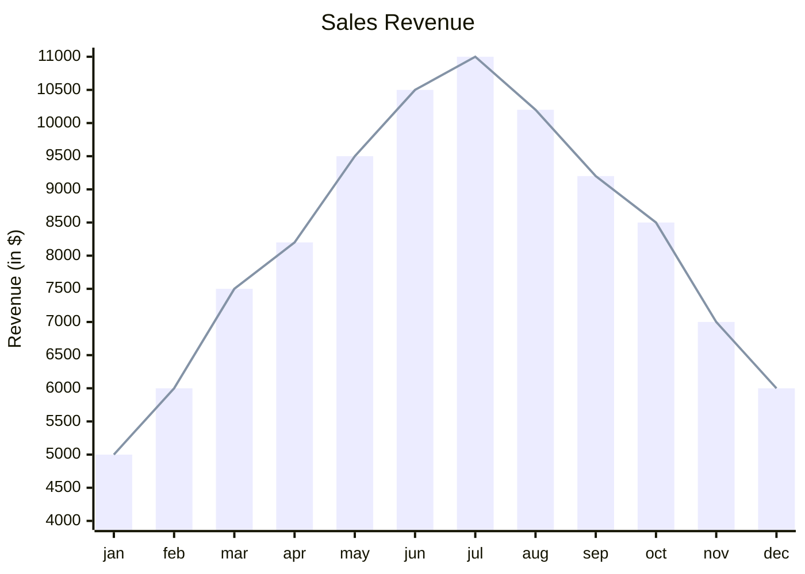
